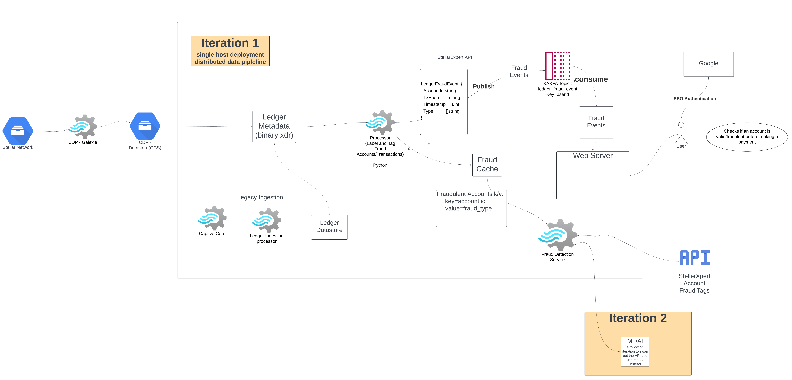

# cdp_fraud_detect, aka 'Deceptiscan', a CDP hack-a-thon exercise 

## Premise:
Demonstrate a data pipeline which leverages [CDP](https://stellar.org/blog/developers/composable-data-platform) pre-computed ledger metadata instead of using captive core architecture, for benefits:
* faster application startup time, using CDP, application processes can access latest Stellar network ledger metadata in seconds, whereas captive core requires 15-30 minutes to sync to network first. 
* lightweight host compute requirements, usingh CDP, no additional compute requirements in Storage,RAM or CPU are required on the application host, whereas captive core requires a couple hundred GB's of high throughput(IOPS), and at least a dual core CPU to support the extra o/s process to run core.
* less client application code,  using CDP, applications can leverage streaming data helper functions such as [cdp.ApplyLedgerMetadata()](https://github.com/stellar/go/blob/master/ingest/cdp/producer.go#L89) to focus on application concerns, no ingestion infrastructure or boilerplate code required, just a pure callback for your app to receive ledger metadata.
  

## Design proposal:

A distributed data pipeline, consisting of a CDP Datastore(GCS Bucket) as the origin of network ledger metadata, Kafka as messaging middleware, and event driven microservices as processors.



## Setup Prerequisites
(1) The ./python-app contains a full-stack web app and leverages Google Oauth, so you will need to create and register your Web-app as a oauth client. Please follow instructions [here](https://www.youtube.com/shorts/WABhO9KsOpU)
  
(2) You will need to provide the credentials from the previous step in a `client_secret.json` file at top of project folder.
This file will have Oauth credentials - specifically, client_id, client_secret, the URI for redirection, once you are OAuthed by Google. You can find these credentials from the Credential tab on your `https://console.cloud.google.com/apis/credentials` and can download a JSON file .

Sample `client_secret.json` file

```commandline
{
  "web": {
    "client_id": "xxx",
    "project_id": "xxx",
    "auth_uri": "https://accounts.google.com/o/oauth2/auth",
    "token_uri": "https://oauth2.googleapis.com/token",
    "auth_provider_x509_cert_url": "https://www.googleapis.com/oauth2/v1/certs",
    "client_secret": "xxx",
    "redirect_uris": [
      "http://localhost:8000/callback"   ---> This should match what you have configured on step 2, when creating your OAuth Client on Google
    ],
    "javascript_origins": [
      "http://localhost:8000"
    ]
  }
}
```
  
(3) Config for GCS Bucket access to get Testnet data.
  * verify in `cdp_processor/config.toml` that `destination_bucket_path` has the correct GCS bucket name for target GCS bucket.
  * Make sure to have a valid GCP authentication context installed on local workstation to access the GCS bucket configured in cdp_processor/config.toml, this is a good reference on how-to https://github.com/stellar/go/blob/master/services/galexie/README.md#set-up-gcp-credentials 
  * The processing is pre-set for Testnet network, it has been hardcoded to testnet history archives and passphrase.
  
(4) Create and fund four test accounts on Testnet. You have 3 choices on how to go about it.
  * use [Stellar Laboratory](https://lab.stellar.org/account/create?$=network$id=testnet&label=Testnet&horizonUrl=https:////horizon-testnet.stellar.org&rpcUrl=https:////soroban-testnet.stellar.org&passphrase=Test%20SDF%20Network%20/;%20September%202015;&endpoints$params$order=desc&limit=200;;&transaction$build$operations@$operation_type=&params@;;):
  * User Stellar Freighter browser extension.
  * Enable the account seeding tool, [SEED_ACCOUNTS](./docker-compose.yml#L55), it is included in this repo. When enabled, it create the accounts on Testnet, fund them, and inject the accounts into the local fraudulent accounts data(can skip step #5). 
     * You can find the generated Acc-1 through Acc-4 key pairs from the  `cdp_processor` log outout via `docker-compose logs cdp_processor`.

  afterwards, you should have four public account id's:

  Acc-1 = `G...`

  Acc-2 = `G...`

  Acc-3 = `G...`

  Acc-4 = `G...`

(5) Acc-1, Acc-2 and Acc-3 can be artificially inserted into the local fraudulent accounts data, which are also fed externally from stellarxpert feed, this is to facilitate repeateable demo, as these new accounts won't be marked as fraudulent in stellarxpert feed. 
  * Skip this step if you used `SEED_ACCOUNTS` during step #4, this has been done for you.
  * Edit ./fetch_store_unsafe_accts/test_data_config.json, and set the account addresses you just created into that file, when demo is started, they will be seeded automatically into local fraudulent accounts data.
  

### Build and Run the Demo

Demonstrate the fraud detection can be done against these testnet accounts:

1. run `docker compose up --build -d` from top folder of repo.
2. browse to localhost:8000, login
3. register Acc-2 for watch
4. Create a tx to send payment from Acc-1 to Acc-2, use lab or freighter. 
5. Go to activity list, see this payment show up as a fraud related to Acc-2, may need to refresh to see it arrive, click on the tx hash link to see detail on horizon
6. Delete Acc-2 from watcher registration, and create new watcher registration for 'all accounts' checkbox
7. Create a tx to send payment from Acc-4 to Acc-3, use lab or freighter.
8. Go to activity list, see this payment show up as a fraud related to Acc-3 due to 'all accounts', click on the tx hash link to see detail on horizon.
9. run `docker compose down` from top folder of repo to stop the demo.